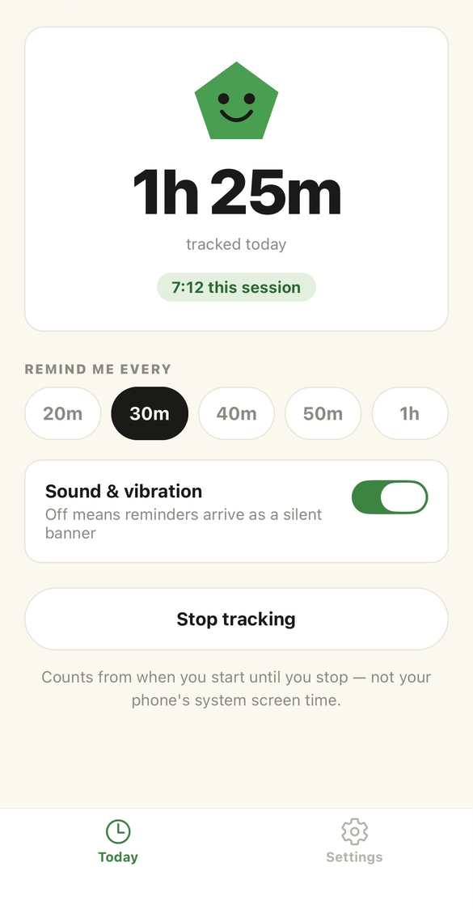
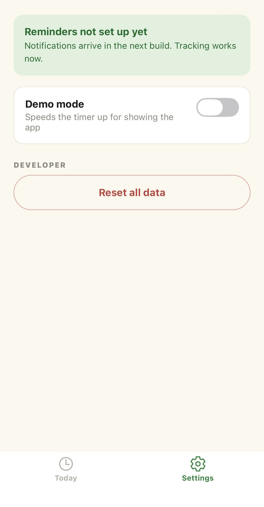

# TimeSve

A screen-time awareness app for iOS. Pick how often you want a nudge — every
20, 30, 40, 50 minutes or an hour — and TimeSve keeps count of how long you
have been going.

Built with Expo and React Native. Runs in Expo Go on a physical iPhone.

## Screenshots

| Today | Settings |
| --- | --- |
|  |  |

## What it does

- **Tracks a session.** Tap *Start tracking* and the day total climbs. The big
  number is the total for today; the small green pill is the current session,
  ticking every second.
- **Interval picker.** Choose your reminder spacing: 20m, 30m, 40m, 50m or 1h.
- **Sound & vibration switch.** iOS ties a notification's vibration to its alert
  sound, so this is deliberately one control, not two — on means the reminder
  alerts, off means it lands as a silent banner. Flipping it on buzzes the phone
  so you can feel what you are choosing.
- **Survives being closed.** Time is banked whenever the app backgrounds, so
  force-quitting loses at most a few seconds rather than the whole session.
- **Everything stays on the device.** No account, no server, no analytics. All
  state lives in AsyncStorage.

Days roll over at local midnight, never UTC.

## What it does not do

- **Notifications are not wired up yet.** The interval and alert settings save
  correctly, but nothing fires. That is the next milestone.
- **It counts from when you press Start — not your phone's real screen time.**
  iOS only exposes genuine usage through the Screen Time API (FamilyControls /
  DeviceActivity), which requires an entitlement granted by Apple on request, a
  paid developer account and a native build. Out of scope for this phase. The
  app never claims otherwise on screen.
- **No push notifications.** Local scheduled notifications only, by design.

## Tech

- Expo SDK 57, React Native 0.86, React 19, TypeScript (strict)
- Expo Router with a two-tab layout
- AsyncStorage for persistence
- react-native-svg for the mascot

Two deliberate constraints in the code:

- `lib/storage` is the only module that touches AsyncStorage. No screen reads or
  writes storage directly, and every read is defensive — missing, partial and
  corrupt data all fall back to a sane default instead of throwing.
- Sessions use a watermark (`lastCommitAt`) rather than a running total, so
  committing time twice can never double count it.

## Running it

You need Node, an iPhone with [Expo Go](https://expo.dev/go) installed, and both
devices on the same Wi-Fi network.

```bash
npm install
npx expo start
```

Scan the QR code with the iPhone camera. Notifications do not work in the iOS
simulator, so test on a real device.

## Status

Phase 1 (UI) and Phase 2 (local storage and tracking) are done and running on
device. Next up:

- Local notifications firing on the chosen interval
- Demo mode, so the loop can be shown without waiting 20 minutes
- Recording each reminder that fires
